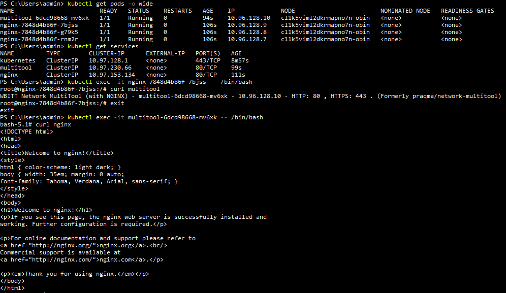
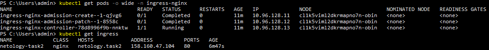
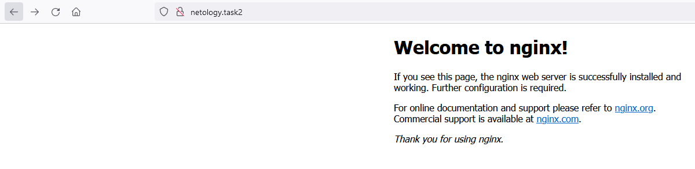
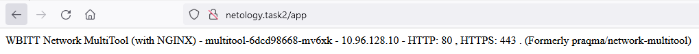

# Домашнее задание к занятию «Сетевое взаимодействие в K8S. Часть 2» Соловьев Д.В.
1. Kubernetes manifest файлы c описаним деплоймента и сервиса для [nginx](./kubernetes%20manifests/nginx.yaml) и [multitool](./kubernetes%20manifests/multitool.yaml).  
   Запущенные деплойменты и сервисы, а также выполнение команды ```curl``` к сервисам изнутри подов:  
     

2. [Kubernetes manifest файл](./kubernetes%20manifests/ingress.yml) для ingress.  
   Запущенные nginx ingress controller и ingress для созданных в первом задании сервисов:  
   
   Страница с nginx через браузер:  
     
   Страница с multitool через браузер:  
   